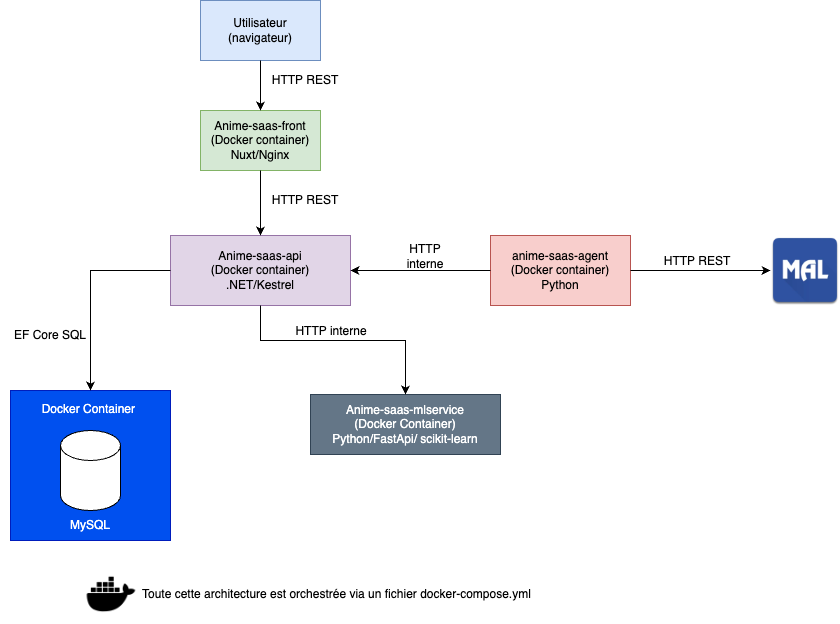

# Animesphere

Bienvenue dans le projet **Animesphere** 🎯🚀

Ce projet est une plateforme SaaS complète permettant de recommander et suivre les animes de saison, avec une UX simple et moderne

---

## 📚 Pourquoi AnimeSphere ?

Les plateformes existantes :
- recensent tout,
- recommandent peu,
- privilégient la popularité.

AnimeSphere fait l’inverse.

Ce n’est pas une encyclopédie.
C’est un **outil de décision** :
“Qu’est-ce que je regarde cette saison ?”

## 📦 Stack technique utilisée

- Frontend ➔ **Nuxt 3** (Vite)
- Backend ➔ **.NET 8 API Web**
- Machine Learning ➔ **Python + FastAPI**
- Agent IA ➔ **Python** (microservice autonome de scraping et enrichissement de données)
- Reverse Proxy ➔ **Nginx**
- Base de données ➔ **MySQL 8**
- Infrastructure ➔ **Docker + Docker Compose**

L'infrastructure est entièrement **dockerisée** pour simplifier le développement, les tests et le déploiement 🚀.

👉 Schéma ici : 

---

## 🚀 Démarrage rapide

```bash
git clone --recurse-submodules <url-du-repo>
```

2. Placez-vous dans le projet :

```bash
cd anime-saas-platform
```

3. Lancez l'environnement de développement :

```bash
make up
```

Cela démarrera tous les services nécessaires en mode développement avec **hot reload**.

4. Pour arrêter les services :

```bash
make down
```

---

## 📚 Documentation

👉 [Accéder à l'espace Notion complet](https://animesphere.notion.site/)

---

## 🧠 Commandes utiles

| Commande | Description |
|:---|:---|
| `make up` | Démarre tous les services en mode développement |
| `make prod` | Démarre tous les services en mode production |
| `make down` | Stoppe tous les services |
| `make clean` | Nettoie tous les containers, images et volumes |
| `make ps` | Affiche les containers en cours d'exécution |
| `make test` | Lance les tests |

---

## 🚧 Statut du projet

AnimeSphere est actuellement en **phase de MVP avancé**.

- Fonctionnalités clés implémentées et opérationnelles
- Prototype déployé et testable
- Phase de bêta privée imminente 👀
- Focus actuel : qualité des contenus et optimisation des parcours utilisateurs
